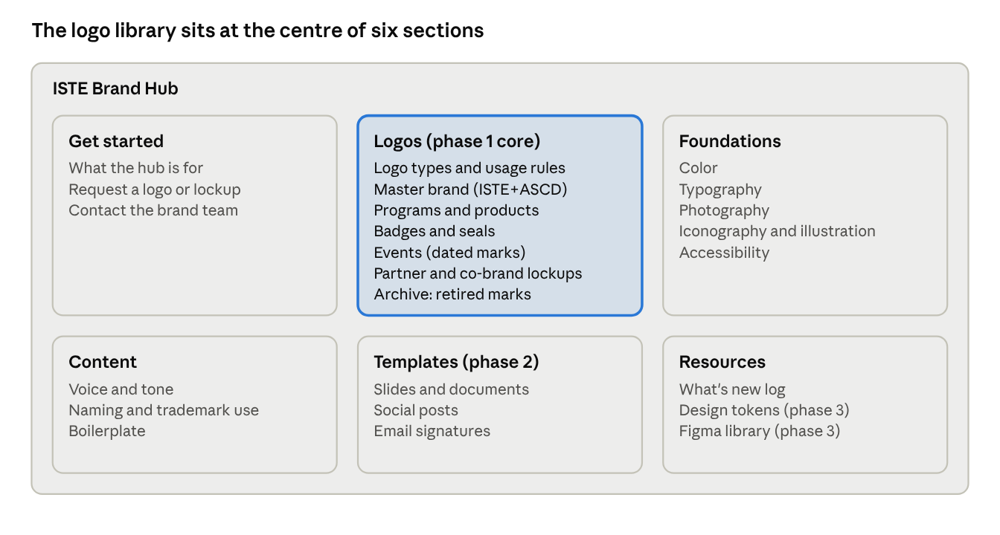
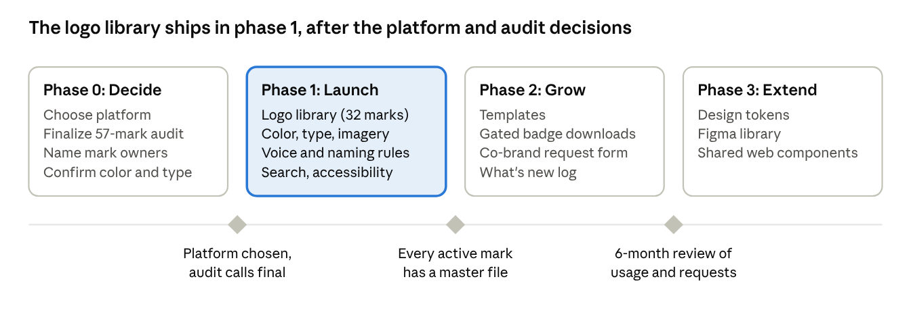

# ISTE Brand Hub: PRD

Oct 1, 2026 · Nick Cronin · Live version: https://claude.ai/code/artifact/6565649d-b2d7-4f23-8fcf-ae5fb6bb8549

> **Demo build note.** The PRD below describes the full product. For the Vercel demo: Nick owns every mark, logos are served from Google Drive (with local fallbacks in `public/logos`), there is no auth, CMS or admin, and only P0 items that make sense without a backend are built. See `CLAUDE.md`.

## Summary

Build an ISTE Brand Hub: one public site where anyone can find the right ISTE+ASCD logo, download it in the right format, and see how to use it. The model is [atlassian.design](https://atlassian.design/), which puts its foundations (color, type, icons, logos), content guidance and components under one search and one navigation.

The first release focuses on what the brand audit shows is missing: a governed logo library with one approved file set per active mark, plus the core brand rules (color, type, voice, imagery).

**Goal:** every active ISTE mark has one approved, downloadable file set on the hub, and retired marks are clearly labeled so nobody uses them by mistake.

## Benchmark: atlassian.design

Its [Logos page](https://atlassian.design/foundations/logos) sorts every mark into a few named logo types, gives each type its own usage rules, and offers one download per mark containing all approved color and layout variations. Atlassian's logo types map onto ISTE's audit groups:

| Atlassian logo type | Atlassian rule | ISTE equivalent |
| --- | --- | --- |
| Company logo | The one iconic mark | Group 1: ISTE / ISTE+ASCD master brand |
| Property logos | Logomark + wordmark + property name | Group 4: "Level 1 logo + text" (ISTE Certification, Books, Standards) |
| App logos | Distinct glyph in a colored tile | Group 3: aligned logos with their own mark (ISTE U, Creative Constructor Lab, ISTE Live) |
| Attribution logos | Product mark + parent strapline; never self-composed | Group 2 sub-brands ("an ISTE initiative": SkillRise, EdSurge co-brand) |

## Problem

ISTE has 57 logos and lockups in circulation, no single source for them, and no published rule for which are current. The Brand Lockup Checklist (based on the Aug 2021 Brand Treatment audit) proposes a fate for each:

| Decision | Marks | What the hub does |
| --- | --- | --- |
| Retire | 25 | Archive with "Retired, do not use"; no downloads |
| Refresh | 16 | Redrawn, then published |
| Keep | 11 | Published once a master file is confirmed |
| Merge | 4 | Folded into another mark; old name redirects |
| Rename | 1 | ISTE Connect, under its new name |

Logo files found so far: 37 of 57 marks (many low-resolution or cropped from PDFs); 20 have no copy online. Three marks are "Unsure", two rows are "TBD", and no owner was recorded.

## Users

| User | Typical task | Need |
| --- | --- | --- |
| ISTE+ASCD staff | Deck, flyer, email, event page | Current logos, colors, type, templates, voice |
| Sponsors and exhibitors | Promote ISTELive presence | This year's Exhibitor/Presenter/Sponsor mark and rules |
| Affiliates and authorized providers | Show the ISTE relationship | Right lockup and wording rules |
| Certified educators and Seal holders | Add a badge to a profile or product | Badge or seal with date and claim rules |
| Press and partners | Cite or co-brand | Master logo, boilerplate, co-branding rules, contact |
| Agencies | Produce work for ISTE | Full foundations and source files |
| Brand team | Keep it current | Add, update, retire, approve marks |

## Scope and information architecture

Six sections: Get started, Logos (core), Foundations, Content, Templates (phase 2), Resources. Search and logo filters work across every section.

## Requirements

| Area | Requirement | Priority | In demo? |
| --- | --- | --- | --- |
| Logo library | One page per mark: preview, description, logo type, status, owner, last updated | P0 | Yes |
| Logo library | One download per mark with every approved variation (SVG, PNG, PDF/EPS) | P0 | Single files only |
| Logo library | Filter by logo type and status; retired marks hidden, shown in an archive | P0 | Yes |
| Logo library | Usage rules per logo type: clear space, minimum size, color options, alt text, misuse examples | P0 | Yes (draft copy) |
| Logo library | Dated marks show the current year and archive past years | P0 | Labels only |
| Logo library | Co-branding rules and a request form | P1 | Form as mailto |
| Foundations | Color values and WCAG AA contrast pairs | P0 | Yes (working palette) |
| Foundations | Typography | P0 | Yes |
| Foundations | Photography, iconography, illustration | P1 | Placeholder pages |
| Content | Voice and tone, naming rules, boilerplate | P0 | Yes (draft copy) |
| Site | Search across pages and marks, by name and alias | P0 | Yes |
| Site | WCAG 2.2 AA; works on phones | P0 | Yes |
| Site | What's new changelog | P1 | Yes (static) |
| Templates | Slides, documents, social, email signatures | P1 | No |
| Access | Gated downloads for restricted marks | P1 | No |
| Design tokens / Figma | Tokens and Figma library | P2 | No |
| Components | Shared coded UI components | P2 | No |
| Admin | Brand team edits without a developer | P0 | No (edit logos.json) |

## Logo record (content model)

Name, aliases, logo type, audit group, status (Active, Refresh in progress, Retired), replaced by, valid dates, owner, description and usage, files (SVG, PNG, PDF/EPS; color, one-color, reversed; horizontal, stacked), alt text, access (Public or Restricted), last updated. `data/logos.json` holds the demo subset of these fields.

Governance: brand team approves every new or changed mark; files come only from master vector sources; retired marks keep a page saying what to use instead; owners review marks yearly.

## Phased plan

- **Phase 0, Decide:** platform, final audit calls, owners, official color and type.
- **Phase 1, Launch:** logo library (~32 marks), color/type/imagery, voice and naming, search and accessibility.
- **Phase 2, Grow:** templates, gated badge downloads, co-brand request form, what's new.
- **Phase 3, Extend:** design tokens, Figma library, shared web components.

## Success metrics

| Metric | Target |
| --- | --- |
| Active marks with an approved master file set | 100% at launch |
| Marks with a named owner | 100% at launch |
| Logo requests emailed to the brand team | Down 50% in 6 months (assumption) |
| Retired marks found in new materials | Zero in quarterly spot checks |
| Searches ending in a download | Baseline in month 1, then rising |

## Risks and open decisions

- Missing masters: 20 marks have no file; many others are low-resolution. Commission vector redraws.
- Co-brand rights: EdSurge, Old Dominion University, Metiri need sign-off.
- Dated marks go stale yearly: each needs an owner and review date.
- Decisions: platform; final audit calls (3 Unsure, 2 TBD, and active-but-retired rows such as Making IT Happen and ISTE Certification); owners; restricted marks; official colors and type; whether ASCD marks are in scope.
